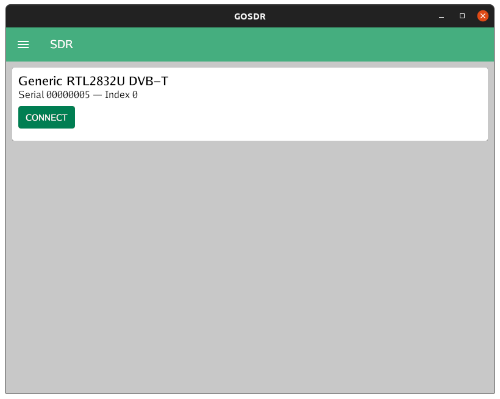
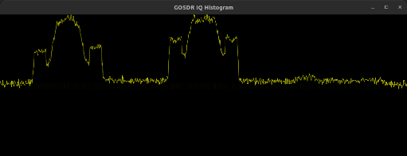

# gosdr

## Dependencies

### Ubuntu

* ```bash
  apt install librtlsdr-dev gcc pkg-config libwayland-dev libx11-dev \
      libx11-xcb-dev libxkbcommon-x11-dev libgles2-mesa-dev \
      libegl1-mesa-dev libffi-dev libxcursor-dev libvulkan-dev
  ```

### Go

* [goenv](https://github.com/fernandosanchezjr/goenv): recommended when compiling from the command line

## WIP

### GOSDR

* GIO UI
* Automatic RTL-SDR device management
  * Safe device removal handling
  * Automatic resume on device re-connection



```
$ gosdr -?
flag provided but not defined: -?
Usage of gosdr:
  -log-level string
        log level (panic, fatal, error, warn, info, debug, trace) (default "info")
  -log-path string
        log path (default "/home/username/.config/gosdr/v0/logs/log.out")
  -log-to-file
        enable logging to file (default true)
$ gosdr
INFO[2022-01-18T22:34:04.170-0800] Received device event                         eventType="Device added" index=0 serial=00000005 type=RTL-SDR
INFO[2022-01-18T22:34:13.159-0800] Received device event                         eventType="Device removed" index=0 serial=00000005 type=RTL-SDR
INFO[2022-01-18T22:34:18.183-0800] Received device event                         eventType="Device added" index=0 serial=00000005 type=RTL-SDR
```

### GOSDRFM

* Automatic RTL-SDR device management
* FM signal histogram - now even less wonky than before
  * WIP conversion to pure GIO 



```
$ gosdrfm -?
flag provided but not defined: -?
Usage of gosdrfm:
  -agc
        enable AGC
  -auto-gain
        enable auto-gain
  -frequency string
        tuner frequency in Hz (default "96.5MHz")
  -frequency-correction int
        frequency correction in PPM
  -gain float
        gain level in dB (default 1)
  -index int
        device index
  -log-level string
        log level (panic, fatal, error, warn, info, debug, trace) (default "info")
  -log-path string
        log path (default "/home/username/.config/gosdr/v0/logs/log.out")
  -log-to-file
        enable logging to file (default true)
  -rtl
        use RTL-SDR devices
  -serial string
        device serial
$ gosdrfm -frequency=99.7M -rtl -serial=00000005
Found Rafael Micro R820T tuner
Exact sample rate is: 2400256.184264 Hz
[R82XX] PLL not locked!
[R82XX] PLL not locked!
Allocating 15 zero-copy buffers
INFO[2022-01-18T22:38:08.418-0800] Sampling SDR                                  agcMode=false autoGain=false biasTee=false centerFrequency="99.7 MHz" gain=0.9 gains="[0 0.9 1.4 2.7 3.7 7.7 8.7 12.5 14.4 15.7 16.6 19.7 20.7 22.9 25.4 28 29.7 32.8 33.8 36.4 37.2 38.6 40.2 42.1 43.4 43.9 44.5 48 49.6]" index=0 manufacturer=Generic mode=0 offsetTuning=false open=true ppm=0 productName="RTL2832U DVB-T" rtlFrequency="28.8 MHz" sampleRate="2.400256 Msps" serial=00000005 tunerFrequency="28.8 MHz" tunerType=RTLSDR_TUNER_R820T type=RTL-SDR
```
